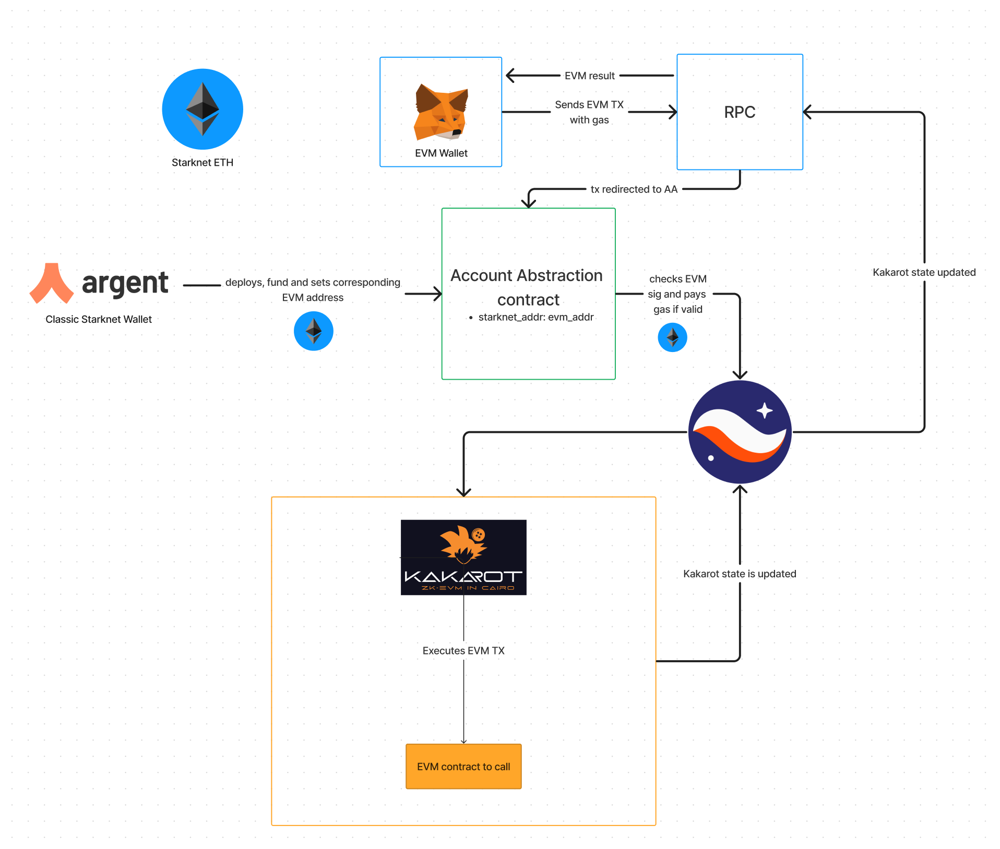

    

  <h3 align="center">
    Kakarot Ethereum Account Abstraction written in Cairo
  </h3>

The Kakarot Ethereum Account Abstraction (KETHAA) is an account contract written in Cairo which verifies EVM compatible transactions and executes them inside the [Kakarot ZK EVM](https://kakarot.org) on [Starknet](https://starkware.co/starknet/). 

# What is Kakarot ?

Kakarot is an Ethereum Virtual Machine written in Cairo. It means it can be deployed on StarkNet, a layer 2 scaling solution for Ethereum, and run an EVM bytecode program. Hence, Kakarot can be used to run Ethereum smart contracts on StarkNet. Kakarot is the super sayajin zkEVM! Why? Because: `It's over 9000!!!!!`.

It is a work in progress, and it is not ready for production.

More information [here](https://github.com/sayajin-labs/kakarot/)

# How can we validate Ethereum Transactions on Starknet (non EVM) ?

The core functionality is *Account Abstraction*. On Ethereum, an External Owned Account (EOA) is created with a private key: no need to interact with the blockchain. But it constraints a lot of modularity and customization. On the other side, we have contracts but they must be executed by at least one EOA. Here is where *Account Abstraction* comes into play: it is the ability to program an account. On Starknet, accounts are contracts, but with one main difference, an account contract can choose programmatically what it considers a valid transaction. If it considers the transaction valid, the account contract is assigned as the sender of the transaction (pays the fees). So technically we could create an account contract that validates all transactions including an emoji. To make it work with Ethereum Transactions we verify that the transaction has been signed with the correct Ethereum private key using the Ethereum signing algorithm.

Read more about:
- [Account Abstraction](https://eips.ethereum.org/EIPS/eip-2938)
- [Account Abstraction on Starknet](https://docs.starknet.io/documentation/architecture_and_concepts/Account_Abstraction/introduction/)
- [Ethereum Accounts](https://ethereum.org/en/developers/docs/accounts/)

# Infrastructure

# Setup

Default account seed: 497146928
